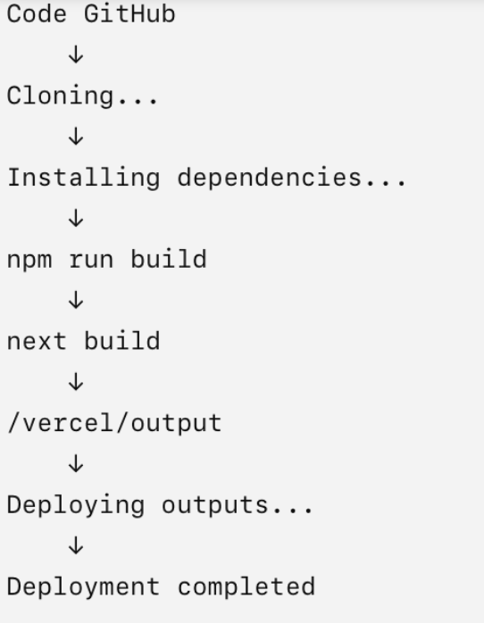
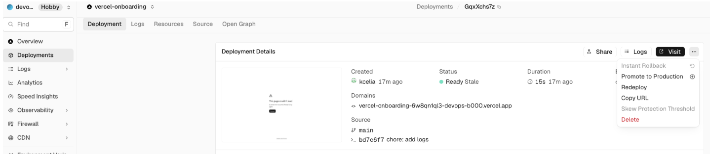
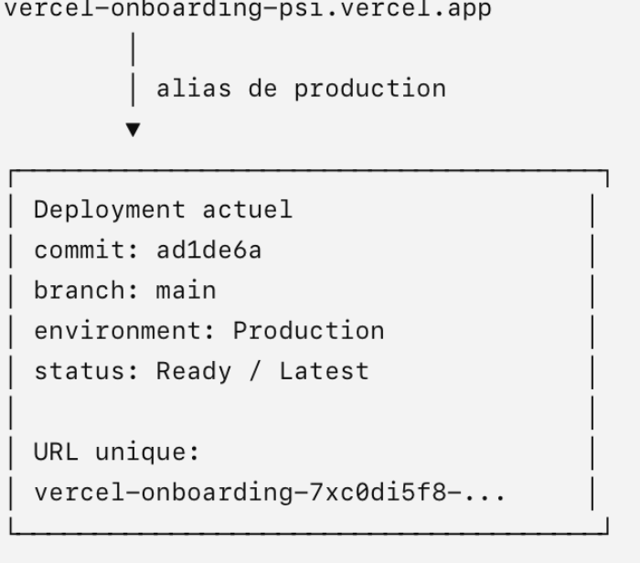
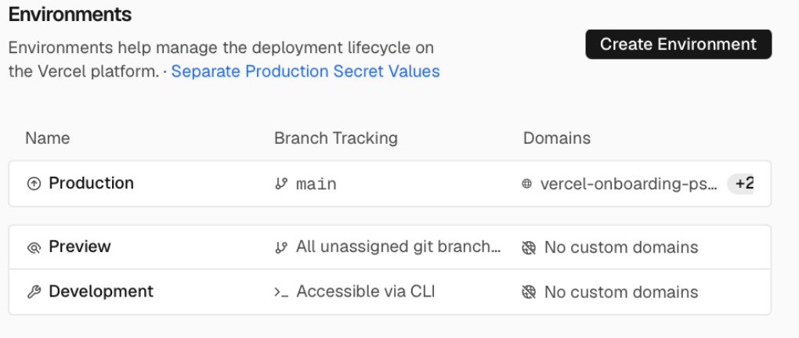
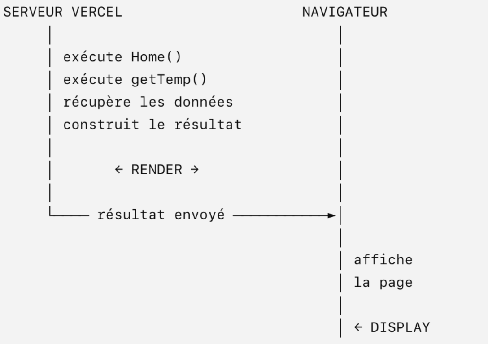

## Phase 1 — First Deployment

**Goal:** a git push produces a live URL, and you can explain what happened in between


#### Reminder:

| File | Role |
|---|---|
| `app/page.tsx` | Defines the home page at `/`. |
| `app/api/weather/route.ts` | Defines the weather endpoint; its exported `GET()` function handles `GET /api/weather`. |


##### APIs, Routes, and External APIs

- An **API — Application Programming Interface** allows programs to communicate.
- An HTTP API exposes operations through URLs and HTTP methods, for example:

```http
GET    /api/weather
GET    /api/users
POST   /api/users
DELETE /api/users/123
```

- A **route** maps a request path and HTTP method to the code that handles it. In our Next.js application, `GET /api/weather` calls the exported `GET()` function in `app/api/weather/route.ts`.

- An **endpoint** is a specific access point exposed by the API. Locally, our weather endpoint is `GET http://localhost:3000/api/weather`. The same path can support different operations depending on the HTTP method.

- An **external API** belongs to another service. Our weather route calls Open-Meteo's external API, extracts the temperature, and returns it to our application. Open-Meteo runs on its own infrastructure; we do not deploy it to Vercel.

--------

### Ajoute le backend meteo

- créer cette route : `GET /api/weather` qui sera implémentée par : `app/api/weather/route.ts`

```
mkdir -p app/api/weather
touch app/api/weather/route.ts
# Add code
```

- Le code de app/api/.../route.ts s’exécute côté serveur et n’est pas envoyé au navigateur. Mais les routes HTTP qu’il expose sont accessibles au navigateur.
- Grâce à l’App Router : `app/api/weather/route.ts` crée automatiquement la route HTTP : `GET /api/weather`, tu peux appeler : http://localhost:3000/api/weather

- app/page.tsx est la page d’accueil de ton application Next.js avec l’App Router.
- app/ → contient les routes/pages de ton application.
- page.tsx → indique à Next.js : que la route / possède une page.
- page.tsx = le fichier qui donne du contenu à une route


----------
✅ 1. Run the app locally with npm run dev and confirm the page renders. The temperature will be missing, because CITY_LAT and CITY_LON are not set yet. That is expected.

- `npm run dev` + `http://localhost:3000`.
- The page renders, but the temperature is missing because `CITY_LAT` and `CITY_LON` are not configured yet (expected).

✅ 2. In Vercel, Add New → Project, import the GitHub repo, and deploy with the default settings.

✅3. Open the deployment's Build Logs and find: the install step, the build step, and the point where the build output is uploaded.

```
11:30:58.318 Running build in Washington, D.C., USA (East) – iad1
11:30:58.320 Build machine configuration: 2 cores, 8 GB
11:30:58.487 Cloning github.com/kcelia/vercel-onboarding (Branch: main, Commit: ad1de6a)
11:30:58.488 Previous build caches not available.
11:31:00.021 Cloning completed: 1.534s
11:31:00.909 Running "vercel build"
11:31:00.937 Vercel CLI 59.16.0
11:31:01.191 Installing dependencies...
11:31:09.408 npm warn deprecated eslint@9.39.5: This version is no longer supported. Please see https://eslint.org/version-support for other options.
11:31:15.077
11:31:15.077 added 365 packages in 13s
11:31:15.077
11:31:15.077 150 packages are looking for funding
11:31:15.078   run `npm fund` for details
11:31:15.079 npm warn allow-scripts 1 package has install scripts not yet covered by allowScripts:
11:31:15.079 npm warn allow-scripts   unrs-resolver@1.12.2 (postinstall: node postinstall.js)
11:31:15.080 npm warn allow-scripts
11:31:15.081 npm warn allow-scripts Run `npm approve-scripts --allow-scripts-pending` to review, or `npm approve-scripts <pkg>` to allow.
11:31:15.150 Detected Next.js version: 16.3.5
11:31:15.166 Running "npm run build"
11:31:15.318
11:31:15.319 > vercel-onboarding@0.1.0 build
11:31:15.319 > next build
11:31:15.319
11:31:15.827 ▲ Next.js 16.3.5 (Turbopack)
11:31:16.038   Applying modifyConfig from Vercel
11:31:16.041 ✓ Running next.config.ts took 219ms
11:31:16.065 Attention: Next.js now collects completely anonymous telemetry regarding usage.
11:31:16.065 This information is used to shape Next.js' roadmap and prioritize features.
11:31:16.065 You can learn more, including how to opt-out if you'd not like to participate in this anonymous program, by visiting the following URL:
11:31:16.065 https://nextjs.org/telemetry
11:31:16.065
11:31:16.081
11:31:16.129   Creating an optimized production build ...
11:31:21.375 ✓ Compiled successfully in 4.4s
11:31:21.377   Running TypeScript ...
11:31:23.763   Finished TypeScript in 2.4s ...
11:31:23.767   Collecting page data using 1 worker ...
11:31:24.386   Generating static pages using 1 worker (0/4) ...
11:31:24.485   Generating static pages using 1 worker (1/4)
11:31:24.491   Generating static pages using 1 worker (2/4)
11:31:24.523   Generating static pages using 1 worker (3/4)
11:31:24.525 ✓ Generating static pages using 1 worker (4/4) in 138ms
11:31:24.529   Finalizing page optimization ...
11:31:24.572   Running onBuildComplete from Vercel
11:31:24.639
11:31:24.641 Route (app)
11:31:24.642 ┌ ƒ /
11:31:24.642 ├ ○ /_not-found
11:31:24.642 └ ƒ /api/weather
11:31:24.642
11:31:24.643
11:31:24.643 ○  (Static)   prerendered as static content
11:31:24.645 ƒ  (Dynamic)  server-rendered on demand
11:31:24.645
11:31:25.184 Build Completed in /vercel/output [24s]
11:31:25.225 Deploying outputs...
11:31:30.428 Deployment completed
11:31:30.433 Creating build cache...
11:31:40.608 Created build cache: 10s
11:31:40.608 Uploading build cache [166.93 MB]
11:31:43.518 Build cache uploaded: 2.910s
```

- The build cache is uploaded to speed up future builds



**Deploying the application output and uploading the build cache are separate steps.** The cache upload happens after deployment in these logs.



✅ 4. Open Deployments and note that the deployment has both a unique URL and a project-wide production URL pointing at it.

A deployment can be reached through several URLs:

| URL | Role |
|---|---|
| `vercel-onboarding-psi.vercel.app` | Project production URL: points to the current production deployment. |
| `vercel-onboarding-git-main-devops-b000.vercel.app` | Branch alias: follows deployments for the `main` branch. |
| `vercel-onboarding-7xc0di5f8-devops-b000.vercel.app` | Unique deployment URL: identifies this specific deployment. |



### Review Questions

1. Which branch did Vercel treat as production, and where is that configured?



https://vercel.com/devops-b000/vercel-onboarding/settings/environments


- Vercel treated **`main`** as the production branch.
- Configured under **Settings → Environments → Production → Branch Tracking**.
- Any push to `main` triggers a Production deployment.


2. The page rendered even though the weather route returns an error. Where did that rendering happen: your browser, or a server?

- The page was rendered on the server.
- `app/page.tsx` has no `"use client"` directive, which means that Home by default is a **Server Component**

- **Server Component vs Client Component**:

    - **Server Component:** its code runs on the server. It can access server-side data and secrets, but cannot use browser APIs or React Hooks such as `useState` and `useEffect`.
    - **Client Component:** supports browser interactions, such as clicks, state updates, and effects. Add `"use client"` at the top of the file to define a client boundary.

    In Next.js App Router, pages and layouts are **Server Components by default**.

    | Aspect | Server Component | Client Component |
    |---|---|---|
    | Execution | Runs on the server. | Runs in the browser; can also be prerendered on the server. |
    | Main use | Fetch server data and prepare content. | Handle interactions, state, and browser APIs. |
    | Server secrets | Can access them; must not expose them in output. | Must not receive secrets. |
    | `useState`, `useEffect`, click handlers | Not supported. | Supported. |
    | Declaration | Default for pages and layouts in the Next.js App Router. | Add `"use client"` to define a client boundary. |


- **Rendering vs displaying**:
    -  Server rendering: Next.js executes the page component on the server to process code and data to produce a visual result.
    - Browser display: The browser shows that result on the screen.



- Analyze the logs:
    ```text
    ƒ /
    ƒ /api/weather
    ƒ (Dynamic) server-rendered on demand
    ```
    - The build logs confirmed that `/` was rendered dynamically on demand:

    - `ƒ`: the route runs on the server when requested, rather than being generated as a static page during the build.
    - `/api/weather` returned HTTP 500, but `fetch()` did not automatically throw an exception.
    - Our code read the JSON without checking `res.ok`.
    - With no `temperature` value, the page displayed the fallback `—`.

3. If you push to a branch that is not the production branch, what do you expect to happen?

With my Git integration and default environment setup:

- Vercel creates a **Preview deployment** with its own URL.
- The current production site remains unchanged.
- Merging the changes into `main` triggers a Production deployment.

| Environment | Purpose in our project |
|---|---|
| Development | Local development on our computer. |
| Preview | Hosted deployments used to test changes on other branches. |
| Production | The released application, deployed from `main`. |
