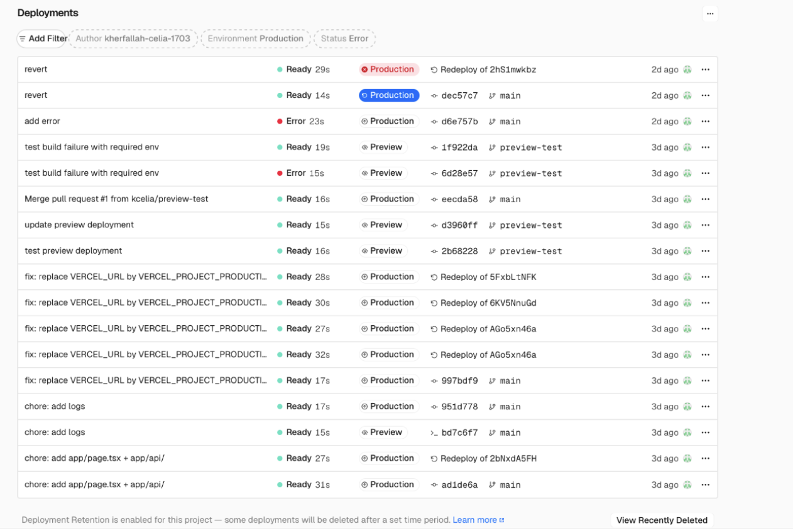

## Phase 4 — Build Failures, Runtime Failures, and Recovery

**Goal:** Distinguish a deployment that failed before release from a deployment that reached Production but fails at runtime.

### Definitions

| Term | Definition |
|---|---|
| **Build time** | The stage where Vercel installs dependencies, checks the code, and creates the deployment output. |
| **Runtime** | The stage where the deployed application handles user requests. |
| **Build failure** | The application could not be built, so the new deployment never became active. |
| **Runtime failure** | The build succeeded, but the deployed application fails while handling requests. |
| **Build Logs** | Logs produced while Vercel is building the application. |
| **Runtime Logs** | Logs produced by the deployed application while it is running. |
| **Instant Rollback** | Point the production domain back to a previous working deployment. |
| **Promote to Production** | Make an existing successful deployment active in Production without rebuilding it. |
| **Auto-assignment** | Automatically point the production domain to the next successful deployment from the production branch. |
| **Recovery time** | The time between deciding to recover and restoring a healthy production site. |


### Failure A

1. Add a line to app/page.tsx that reads an environment variable at module scope and throws if it is missing:

```if (!process.env.REQUIRED_THING) throw new Error("REQUIRED_THING is not set"); ```

Set REQUIRED_THING for Preview only, then merge to main. Production fails to build.

- The Preview    build succeeds because the variable exists in the Preview environment.
- The Production build fails because the variable is missing from the Production environment.
- The failure happens while Next.js is building the application, before the new version is deployed.

✅ Where did you find out it failed?

- Vercel sent a deployment failure email.
- In the Vercel dashboard, the Production deployment had the **Error** status and the Build Logs details indicate that the build did not succeed.

✅ What is production serving to users right now?

- Production continues serving the previous successful deployment.
- The failed build never replaces the active production version.
- Users do not receive the broken version.

✅ Which log did you read to diagnose it?

- The **Build Logs**, because the error occurred during the build.


### Failure B — Runtime Failure

Remove the `REQUIRED_THING` check, then set `WEATHER_API_BASE` in Production to `https://api.open-meteo.invalid/v1` and redeploy.

- The build succeeds. The site is live. The site is also broken.

✅ 1. What are users seeing?

Users see an error page: `this page couldn't load`


✅ 2. Which log did you use?

Failure A: I used the Build Logs because the error happened during the build, before the new deployment could be published.

Failure B: I used the Runtime Logs because the build succeeded and the error only happened when the deployed application was running and tried to call the invalid weather API URL.


✅ 3. How long did it take to notice?

I noticed the failure only after manually opening the production page.
- Without manual testing or monitoring, the failure could have remained unnoticed while affecting users.

✅ 4. Recovery — Instant Rollback

- I used **Instant Rollback** to reactivate the previous working Production deployment.
- Recovery took approximately **2 minutes** from the decision to roll back until the site was healthy.
- Vercel restored service by pointing the production domain to an existing deployment; it did not rebuild the application.
- The rollback did not modify the `main` branch or its Git history.


## After an Instant Rollback

A rollback disables the automatic assignment of production domains. You have two options:

1. Keep the rolled-back version active

- Click **Manage** and re-enable automatic domain assignment.
- The rolled-back version remains active for now.
- After the next successful deployment from `main`, the production domain automatically points to that new deployment.

2. Replace the rolled-back version immediately

- Select an existing successful deployment and click **Promote to Production**.
- Vercel immediately points the production domain to that deployment.
- Promotion uses an existing build: it does not create a new build or modify Git history.


-----------




1. Row 1 — commit: revert
* Ready 29s : le build a réussi en 29 secondes.
* Redeploy of 2hS1mwkbz : ce déploiement a été recréé à partir d’un ancien déploiement, et non directement depuis un nouveau commit Git.
* Le badge Production rouge avec une croix signifie qu’il s’agit bien d’un déploiement destiné à la production, mais qu’il n’est pas actuellement relié au domaine de production.
C’est probablement lié au fait que l’auto-assignation des domaines a été suspendue après ton rollback.

1. Row 2 — commit: revert
* Ready 14s : le build a réussi.
* Production en bleu : c’est le déploiement actuellement promu/actif en production.
* dec57c7 : identifiant court du commit Git.
* main : branche ayant produit ce déploiement.
C’est donc actuellement ta version de production.

3. Row 1 — commit: add error
* Error 23s : le build a échoué après 23 secondes.
* Il ciblait la production, mais comme le build a échoué, il n’a jamais remplacé la version fonctionnelle.
